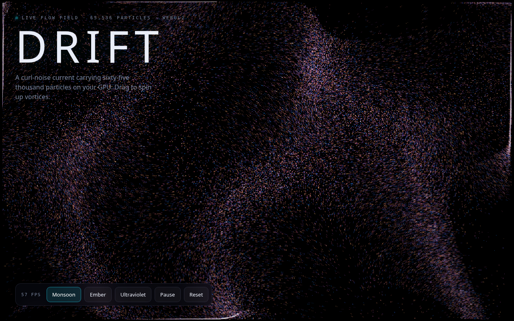

# Drift

**Go with the flow.** Sixty-five thousand particles riding a curl-noise current on your GPU, in the browser. Drag to spin up vortices and watch the trails fold. WebGL2 GPGPU, no server, no dependencies, no build step.

**→ Live: https://drift.signalizeai.org**



## What it is

Particle state (position, age, hue) lives in a float texture. Every frame advects all 65,536 particles through an analytic flow field plus pointer vortices, stamps them additively into a fading trail map, and displays the trails. Three dye palettes (Monsoon, Ember, Ultraviolet); the dish warms itself up so the first paint already flows.

## Controls

- **Drag** — spin vortices into the current
- **Palette** — Monsoon / Ember / Ultraviolet
- **Pause**, **Reset**, and a live fps readout
- Leave it alone and passing currents stir themselves

## Run locally

Open `public/index.html` in a browser, or serve the folder:

```bash
npx serve public
```

## License

MIT
